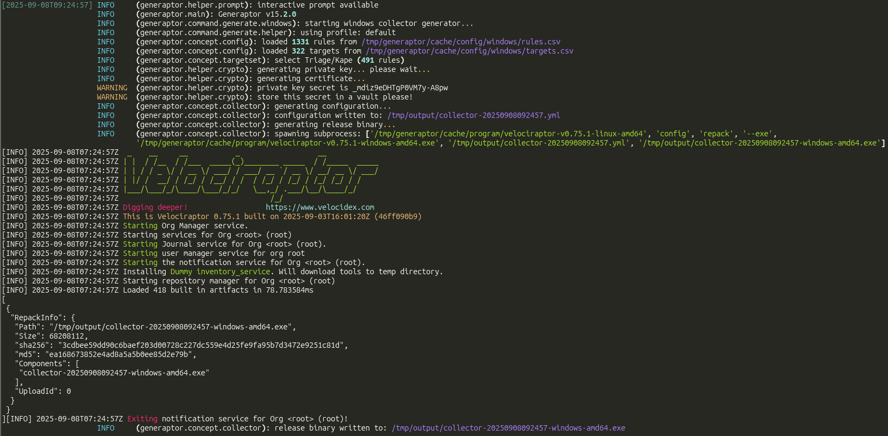

<p align="center"></p>
<h2 align="center">Generaptor</h2>

<div align="center">


[](LICENSE)

</div>

<p align="center">CLI generator for Velociraptor offline collector</p>
<br>

<div align="center">



</div>

# Introduction

Generaptor is a platform-agnostic command line tool to generate a [Velociraptor](https://github.com/velocidex/velociraptor) offline collector based on pre-configured or customizable collection profiles.

All platforms can generate collectors for all targets, there is no limitation thanks to Python on the generation side and velociraptor on the configuration repacking side.

Generation of Darwin collector is not implemented for the moment due to the lack of use case on our side. Feel free to open a pull request regarding this feature.

<br>

## Getting Started

Generaptor releases are available on Github and Pypi. The setup is the same for Linux, Windows and Darwin as long as Python 3.12+ is installed and available through the PATH environment variable. Using a Python virtual environment is recommended.

```bash
# Setup generaptor w/o interactive cli
python3 -m pip install generaptor
# Setup generaptor w/ interactive cli
python3 -m pip install generaptor[pick]
# Setup configuration files and fetch latest stable release of velociraptor
generaptor update
# Create a collector for windows for instance
generaptor generate -o /tmp/generaptor windows
# Keep the private key secret in a password vault to be able to decrypt the archive
# /tmp/generaptor now contains a collector and its configuration file
# Perform collection on target
# Then retrieve collection archive and extract
generaptor extract \
           --directory /tmp/collection \
           /tmp/generaptor/*.key.pem \
           Collection_COMPUTER_DEVICE_YYYY-mm-ddTHH-MM-SS.zip
# Check integrated help for more options
generaptor -h
generaptor generate -h
generaptor generate linux -h
generaptor generate windows -h
```

<br>

## Configuration

Generaptor can use optional configuration files put in `$HOME/.config/generaptor` directory to generate collectors.

Target and rules can be extended using this configuration directory.

VQL templates can also be modified to add custom artifacts or modify the collector behavior. Please refer to [Velociraptor documentation](https://docs.velociraptor.app/) to learn how to master VQL and write your own configuration files.

After starting generaptor for the first time, you can use the following commands to initialize the configuration directory

```bash
# Add variables for directories in current environment
export CACHE="${HOME}/.cache/generaptor"
export CONFIG="${HOME}/.config/generaptor"
# Copy header for each file
head -n 1 "${CACHE}/config/linux/rules.csv" > "${CONFIG}/linux/rules.csv"
head -n 1 "${CACHE}/config/linux/targets.csv" > "${CONFIG}/linux/targets.csv"
head -n 1 "${CACHE}/config/windows/rules.csv" > "${CONFIG}/windows/rules.csv"
head -n 1 "${CACHE}/config/windows/targets.csv" > "${CONFIG}/windows/targets.csv"
# Copy VQL templates
cp "${CACHE}/config/linux/collector.yml.jinja" "${CONFIG}/linux/"
cp "${CACHE}/config/windows/collector.yml.jinja" "${CONFIG}/windows/"
```

<br>

## License

Distributed under the [MIT License](LICENSE).

<br>

## Contributing

Contributions are welcome. See [CONTRIBUTING.md](CONTRIBUTING.md).

### Past contributors (until version 10.0.2)

- [koromodako](https://github.com/koromodako)
- [SPToast](https://github.com/SPToast)
- [td2m](https://github.com/td2m)

<br>

## Security

To report a (suspected) security issue, see [SECURITY.md](SECURITY.md).
